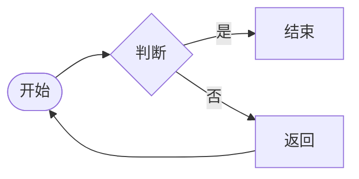
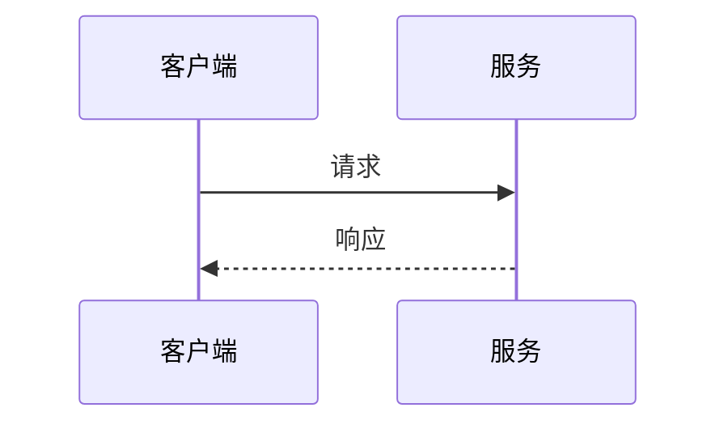
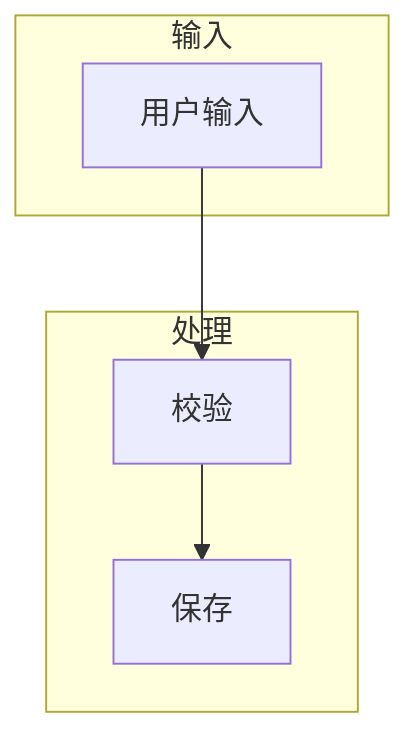
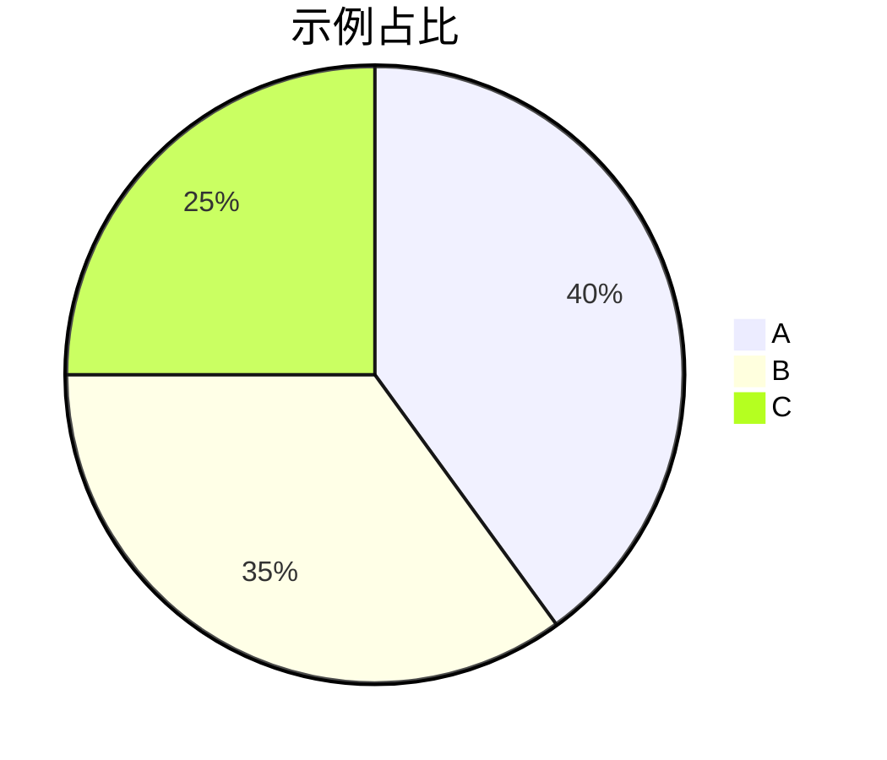
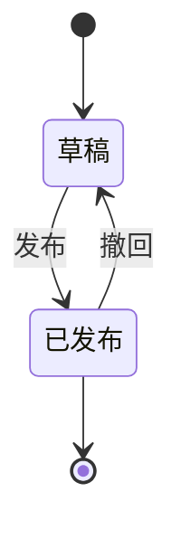
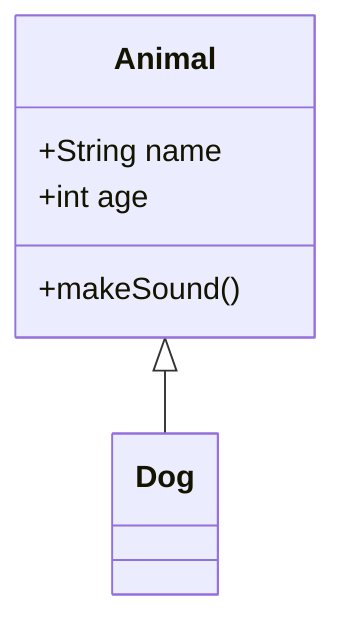

## 主要内容

> #### Markdown*是什么*？
>
> #### *谁*创造了它？
>
> #### *为什么*要使用它？
>
> #### *怎么*使用？
>
> #### *谁*在用？
>
> #### 尝试一下

## 正文

### 1. Markdown*是什么*？

**Markdown**是一种轻量级**标记语言**，它以纯文本形式(*易读、易写、易更改*)编写文档，并最终以HTML格式发布。  
**Markdown**也可以理解为将以MARKDOWN语法编写的语言转换成HTML内容的工具。    

### 2. *谁*创造了它？

它由**[Aaron Swartz](http://www.aaronsw.com/)**和**John Gruber**共同设计，**Aaron Swartz**就是那位于去年（*2013年1月11日*）自杀,有着**开挂**一般人生经历的程序员。维基百科对他的[介绍](http://zh.wikipedia.org/wiki/%E4%BA%9A%E4%BC%A6%C2%B7%E6%96%AF%E6%B2%83%E8%8C%A8)是：**软件工程师、作家、政治组织者、互联网活动家、维基百科人**。    

他有着足以让你跪拜的人生经历：    

- **14岁**参与RSS 1.0规格标准的制订。     
- **2004**年入读**斯坦福**，之后退学。   
- **2005**年创建[Infogami](http://infogami.org/)，之后与[Reddit](http://www.reddit.com/)合并成为其合伙人。   
- **2010**年创立求进会（Demand Progress），积极参与禁止网络盗版法案（SOPA）活动，最终该提案被撤回。   
- **2011**年7月19日，因被控从MIT和JSTOR下载480万篇学术论文并以免费形式上传于网络被捕。     
- **2013**年1月自杀身亡。

Aaron Swartz

天才都有早逝的归途。

### 3. *为什么*要使用它？

- 它是易读（看起来舒服）、易写（语法简单）、易更改**纯文本**。处处体现着**极简主义**的影子。
- 兼容HTML，可以转换为HTML格式发布。
- 跨平台使用。
- 越来越多的网站支持Markdown。
- 更方便清晰地组织你的电子邮件。（Markdown-here, Airmail）
- 摆脱Word（我不是认真的）。

### 4. *怎么*使用？

如果不算**扩展**，Markdown的语法绝对**简单**到让你爱不释手。

Markdown语法主要分为如下几大部分：
**标题**，**段落**，**区块引用**，**代码区块**，**强调**，**列表**，**分割线**，**链接**，**图片**，**反斜杠 `\`**，**符号'`'**。

#### 4.1 标题

两种形式：  
1）使用`=`和`-`标记一级和二级标题。

> 一级标题  
> `=========`  
> 二级标题  
> `---------`

效果：

> # 一级标题   
>
> ## 二级标题

2）使用`#`，可表示1-6级标题。

>  一级标题  
> # 二级标题  
> ## 三级标题  
> ### 四级标题  
> #### 五级标题  
> ##### 六级标题    

效果：

> # 一级标题
>
> ## 二级标题
>
> ### 三级标题
>
> #### 四级标题
>
> ##### 五级标题
>
> ###### 六级标题

#### 4.2 段落

段落的前后要有空行，所谓的空行是指没有文字内容。若想在段内强制换行的方式是使用**两个以上**空格加上回车（引用中换行省略回车）。

#### 4.3 区块引用

在段落的每行或者只在第一行使用符号`>`,还可使用多个嵌套引用，如：

>  区块引用  
> > 嵌套引用  

效果：

> 区块引用  
>
> > 嵌套引用

#### 4.4 代码区块

代码区块的建立是在每行加上4个空格或者一个制表符（如同写代码一样）。如  
普通段落：

void main()  
{  
    printf("Hello, Markdown.");  
}    

代码区块：

```java
void main()
{
  printf("Hello, Markdown.");
}
```

**注意**:需要和普通段落之间存在空行。

#### 4.5 强调

在强调内容两侧分别加上`*`或者`_`，如：

> 斜体，斜体  
> 粗体，粗体

效果：

> *斜体*，*斜体*  
> **粗体**，**粗体**

#### 4.6 列表

使用`·`、`+`、或`-`标记无序列表，如：

> （+） 第一项
> （+） 第二项
>  （+）第三项

**注意**：标记后面最少有一个_空格_或_制表符_。若不在引用区块中，必须和前方段落之间存在空行。

效果：

> - 第一项
> - 第二项
> - 第三项

有序列表的标记方式是将上述的符号换成数字,并辅以`.`，如：

> 1 . 第一项  
> 2 . 第二项  
> 3 . 第三项    

效果：

> 1. 第一项
> 2. 第二项
> 3. 第三项

#### 4.7 分割线

分割线最常使用就是三个或以上`*`，还可以使用`-`和`_`。

#### 4.8 链接

链接可以由两种形式生成：**行内式**和**参考式**。  
**行内式**：

> younghz的Markdown库[https://github.com/younghz/Markdown](https://github.com/younghz/Markdown) "Markdown"。

效果：

> [younghz的Markdown库](https://github.com/younghz/Markdown)。

**参考式**：

> younghz的Markdown库11  
> younghz的Markdown库22  
> 1:[https://github.com/younghz/Markdown](https://github.com/younghz/Markdown) "Markdown"  
> 2:[https://github.com/younghz/Markdown](https://github.com/younghz/Markdown) "Markdown"    

效果：

> [younghz的Markdown库1](https://github.com/younghz/Markdown)  
> [younghz的Markdown库2](https://github.com/younghz/Markdown)

**注意**：上述的`[1]:https:://github.com/younghz/Markdown "Markdown"`不出现在区块中。

#### 4.9 图片

添加图片的形式和链接相似，只需在链接的基础上前方加一个`！`。

#### 4.10 反斜杠`\`

相当于**反转义**作用。使符号成为普通符号。

#### 4.11 符号'`'

起到标记作用。如：

> ctrl+a

效果：

> `ctrl+a`    

#### 5. *谁*在用？

Markdown的使用者：

- GitHub
- 简书
- Stack Overflow
- Apollo
- Moodle
- Reddit
- 等等

#### 6. 尝试一下

- **Chrome**下的插件诸如`stackedit`与`markdown-here`等非常方便，也不用担心平台受限。
- **在线**的dillinger.io评价也不错   
- **Windowns**下的MarkdownPad也用过，不过免费版的体验不是很好。    
- **Mac**下的Mou是国人贡献的，口碑很好。
- **Linux**下的ReText不错。

**当然，最终境界永远都是笔下是语法，心中格式化 :)。**

---

**注意**：不同的Markdown解释器或工具对相应语法（扩展语法）的解释效果不尽相同，具体可参见工具的使用说明。
虽然有人想出面搞一个所谓的标准化的Markdown，[没想到还惹怒了健在的创始人John Gruber]
([http://blog.codinghorror.com/standard-markdown-is-now-common-markdown/](http://blog.codinghorror.com/standard-markdown-is-now-common-markdown/) )。

---

以上基本是所有traditonal markdown的语法。

### 其它：

列表的使用(非traditonal markdown)：

用`|`表示表格纵向边界，表头和表内容用`-`隔开，并可用`:`进行对齐设置，两边都有`:`则表示居中，若不加`:`则默认左对齐。


| 代码库          | 链接                                                                         |
| ------------ | -------------------------------------------------------------------------- |
| MarkDown     | [https://github.com/younghz/Markdown](https://github.com/younghz/Markdown) |
| MarkDownCopy | [https://github.com/younghz/Markdown](https://github.com/younghz/Markdown) |


关于其它扩展语法可参见具体工具的使用说明。

---

## 附录 A：GFM 与常用扩展（本应用预览）

### A.1 删除线（GFM）

~~这是一段被删除线标记的文字~~

### A.2 任务列表（GFM）

- 待办项（未完成）
- 已完成项
  - 嵌套待办

### A.3 自动链接与裸 URL

显式尖括号链接：[https://spec.commonmark.org/](https://spec.commonmark.org/)

同一行内裸 URL（开启 linkify 时识别）：[https://example.com/doc](https://example.com/doc)

### A.4 行内数学（KaTeX）

欧拉公式：$e^{i\pi} + 1 = 0$

行内分数与求和：$\sum_{i=1}^{n} i = \frac{n(n+1)}{2}$

集合与量词：$\forall x \in \mathbb{R}, x^2 \geq 0$；存在：$\exists n \in \mathbb{N}$

微分与向量：$\frac{\partial f}{\partial x}$，单位向量 $\hat{\mathbf{i}}$，范数 $\lVert x \rVert_2$

三角与根式：$\sin^2\theta + \cos^2\theta = 1$，$\sqrt{x^2 + y^2}$

上下标与二项式：$x^{10}$，$x_{i,j}$，$\binom{n}{k}$

### A.5 块级数学（KaTeX）

$$
\int_0^1 x^2dx = \frac{1}{3}
$$

多行对齐（aligned）：

$$
\begin{aligned}
f(x) &= x^2 
f'(x) &= 2x
\end{aligned}
$$

矩阵（bmatrix）：

$$
\mathbf{A} = \begin{bmatrix}
1 & 2 
3 & 4
\end{bmatrix}
$$

分段函数（cases）：

$$
|x| = \begin{cases}
x, & x \geq 0 
-x, & x < 0
\end{cases}
$$

极限与级数：

$$
\lim_{n \to \infty} \frac{1}{n} = 0,
\qquad
\sum_{k=1}^{\infty} \frac{1}{2^k} = 1
$$

### A.6 Mermaid 流程图




### A.7 Mermaid 时序图




子图与纵向流程（`flowchart TB`）：




### A.8 围栏代码（多语言标签）

```ts
export type Theme = 'light' | 'dark';
```

```json
{ "ok": true, "count": 3 }
```

### A.9 复杂表格（对齐）


| 左对齐    | 居中    | 右对齐 |
| ------ | ----- | --- |
| L      | C     | 1.0 |
| `code` | **粗** | 200 |


### A.10 嵌套列表与引用

1. 有序一级
  - 无序子项
  - 另一子项
2. 有序二级

> 外层引用
>
> > 内层引用
> >
> > - 引用内的列表

### A.11 分隔线（多种形式）

---

---

---

### A.12 行内换行（软换行）

第一行末尾两个空格后回车，仍属同一段落。  
这是同一段的第二行（GFM 中常见；本应用 `breaks: true` 时单换行也可分段，以预览为准）。

### A.13 与 Obsidian 的差异说明（阅读时请对照）

以下在 **Obsidian** 中有特殊语义；在本应用中可能按**普通 Markdown**显示，用于检查「是否静默损坏」：

- **Callout**：`> [!note] 标题` 与正文
- **脚注**：示例引用[^fn-demo](这是脚注定义；若未渲染为脚注，将整段当作普通文本排查。) 与文末定义
- **高亮**：`==高亮文本==`
- **注释**：`%% 不显示的正文 %%`
- **块 ID**：单独一行 `^demo-block-id`（会尝试挂到上一块，与 Obsidian 块语法可能略有差异）

> [!warning] Callout 示例（可能显示为普通引用）
>
> 若预览与 Obsidian 不一致，属预期差距。

==若未被高亮渲染，则仍为字面等号==

%% 若整段仍可见，说明未按 Obsidian 注释处理 %%

本段为块 ID锚点前的段落。

^demo-block-id

### A.14 安全 HTML（视净化策略可能折叠）

点击展开（若被允许）

这里是 `details` 折叠区域内的说明正文（勿在正文里再写裸的

 标签，否则会被当成嵌套折叠而搞乱章节边界）。


### A.15 数学公式补充（块级 / 边界）

根号与分式组合：

$$
\sqrt{\frac{a}{b}} = \frac{\sqrt{a}}{\sqrt{b}}
\quad (a,b > 0)
$$

高斯积分（常见排版压力测试）：

$$
\int_{-\infty}^{\infty} e^{-x^2}dx = \sqrt{\pi}
$$

多行公式（无 `aligned`，纯换行）：

$$
f(0) = 1
$$
$$
f(1) = e
$$

行内故意错误式（应降级为原文或错误提示，不应整页崩）：$ \left( \broken $

### A.16 Mermaid 补充（多图类型与 `mmd` 别名）

饼图：




状态图（`stateDiagram-v2`）：




简单类图：




与 `mermaid` 等价的信息密度图（语言标签写 `mmd`）：

```mmd
flowchart LR
  p1([入口]) --> p2[处理]
  p2 --> p3([出口])
```

