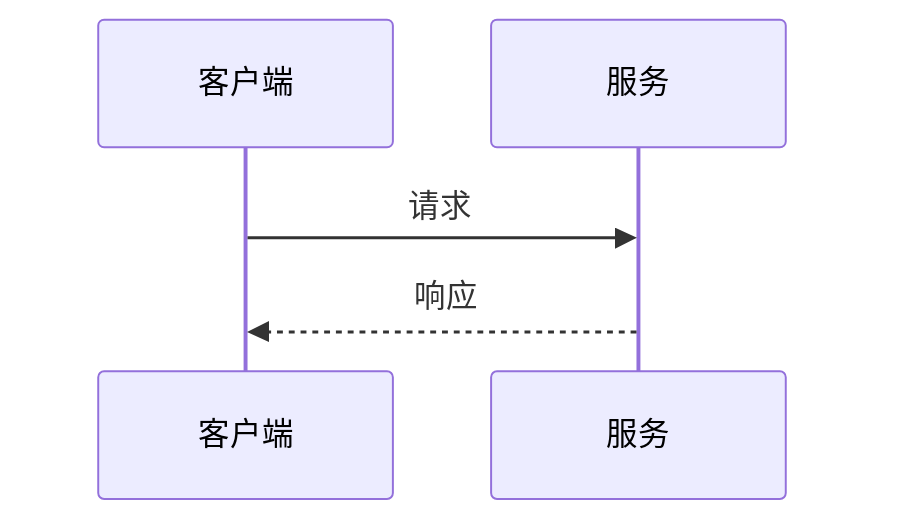
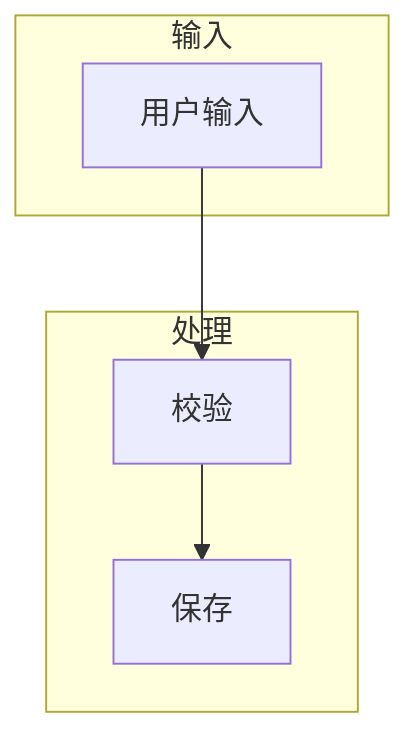
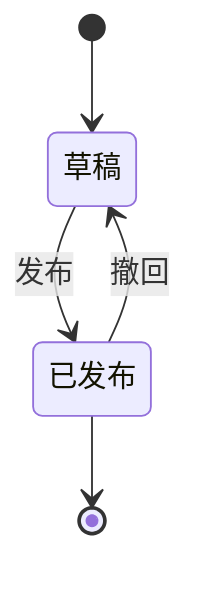
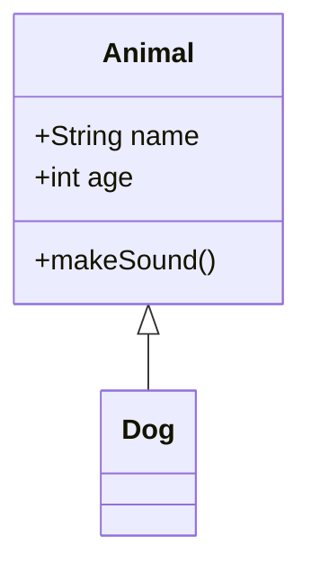
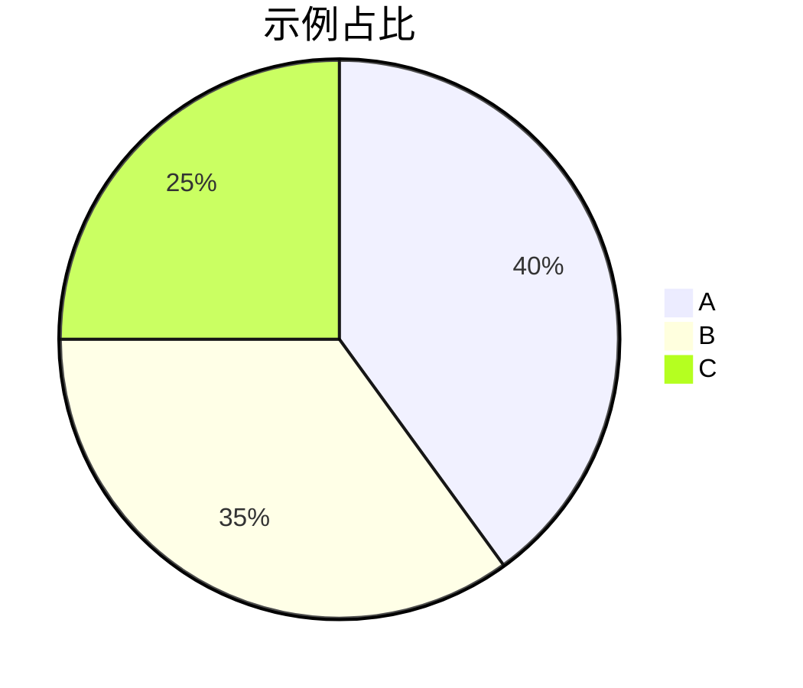

# Markdown 语法示例

> 本页汇总 **M記** 支持的 Markdown 与常见扩展语法。对照左侧源码与右侧预览，检查渲染是否符合预期。  
> Wiki 链接、附件嵌入等 Obsidian 写法见 [[02-Obsidian-内联语法示例]]。

## 正文

### 一、行内语法

#### 强调

普通 **粗体**、*斜体*、***粗斜体***、`行内代码`。

~~删除线~~（GFM）

==高亮==（Obsidian 风格；本应用可能显示为字面 `==`）

#### 链接与图片

[带标题的链接](https://example.com "示例站点")

[相对路径](./01-Markdown-语法示例.md)

自动链接：[https://spec.commonmark.org/](https://spec.commonmark.org/)

裸 URL（linkify）：https://example.com/doc

#### 转义与字面量

\*不是斜体\* \`不是代码\` \[不是链接\]

---

### 二、块级语法

#### 标题

文档内可使用 `#` 至 `######` 六级标题。Setext 风格（下划线 `=` / `-`）亦支持。

#### 段落与换行

段落之间留空行。行末两个空格后回车，仍属同一段落。  
这是同一段的第二行（`breaks: true` 时单换行也可能分段，以预览为准）。

#### 引用

> 单层引用  
> 第二行

> 嵌套引用
>
> > 内层引用

#### 列表

**无序**

- 一级
  - 二级
    - 三级
- 回到一级

**有序（数字）**

1. 第一步
2. 第二步
  - 嵌套无序
3. 第三步

**有序（字母 / 罗马）**

A. 大写字母
B. 第二项
  A. 嵌套字母
  B. 嵌套第二项

a. 小写字母
b. 第二项

ii. 罗马数字（从 ii 起）
iii. 第三项

**任务列表（GFM）**

- [ ] 待办项
- [x] 已完成项
  - [ ] 嵌套待办

#### 代码

行内 `const x = 1` 与围栏代码块：

```javascript
function hello(name) {
  return `Hello, ${name}!`;
}
```

```ts
export type Theme = 'light' | 'dark';
```

```json
{ "ok": true, "count": 3 }
```

缩进代码块（每行前 4 空格）：

    line one
    line two

#### 分隔线

以下三种写法等价：

---

***

___

#### 表格


| 左对齐 | 居中 | 右对齐 |
| :--- | :---: | ---: |
| L | C | 1.0 |
| `code` | **粗** | 200 |


---

### 三、数学公式（KaTeX）

**行内**

欧拉公式：$e^{i\pi} + 1 = 0$

分数与求和：$\sum_{i=1}^{n} i = \frac{n(n+1)}{2}$

**块级**

$$
\int_0^1 x^2 \, dx = \frac{1}{3}
$$

多行对齐（`aligned`）：

$$
\begin{aligned}
f(x) &= x^2 \\
f'(x) &= 2x
\end{aligned}
$$

矩阵（`bmatrix`）：

$$
\mathbf{A} = \begin{bmatrix}
1 & 2 \\
3 & 4
\end{bmatrix}
$$

分段函数（`cases`）：

$$
|x| = \begin{cases}
x, & x \geq 0 \\
-x, & x < 0
\end{cases}
$$

高斯积分：

$$
\int_{-\infty}^{\infty} e^{-x^2} \, dx = \sqrt{\pi}
$$

故意错误式（应降级为原文，不应整页崩溃）：$ \left( \broken $

---

### 四、Mermaid 图表

**流程图（`flowchart LR`）**


**时序图**



**纵向流程与子图**



**状态图**



**类图**



**饼图**



**语言标签 `mmd`（与 `mermaid` 等价）**

```mmd
flowchart LR
  p1([入口]) --> p2[处理]
  p2 --> p3([出口])
```

---

### 五、组合示例

**嵌套列表与引用**

1. 有序一级
  - 无序子项
  - 另一子项
2. 有序二级

> 外层引用
>
> > 内层引用
> >
> > - 引用内的列表

---

### 六、Obsidian 对照（gap）

以下写法在 **Obsidian** 中有特殊语义；本应用可能按普通 Markdown 显示，用于检查「是否静默损坏」：

| 特性 | 说明 |
| --- | --- |
| Callout | `> [!note] 标题` 与正文 |
| 脚注 | `[^id]` 引用与文末 `[^id]:` 定义 |
| 高亮 | `==文本==` |
| 注释 | `%% 不显示的正文 %%` |
| 块 ID | 单独一行 `^block-id` 挂到上一块 |

> [!warning] Callout 示例
>
> 若预览与 Obsidian 不一致，属预期差距。

脚注引用示例[^fn-demo]。

[^fn-demo]: 这是脚注定义；若未渲染为脚注，将整段当作普通文本排查。

==若未被高亮渲染，则仍为字面等号==

%% 若整段仍可见，说明未按 Obsidian 注释处理 %%

本段为块 ID 锚点前的段落。

^demo-block-id

---

### 七、HTML

<details>
<summary>点击展开（若被允许）</summary>

这里是 `details` 折叠区域内的说明正文。

</details>

---

> 不同 Markdown 解释器对扩展语法的支持程度各异，以本应用预览为准。  
> 更多 Wiki / 嵌入语法见 [[02-Obsidian-内联语法示例]]。
