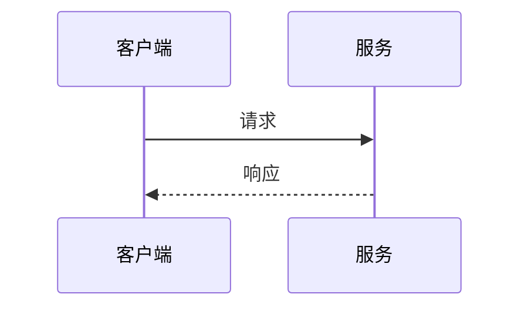
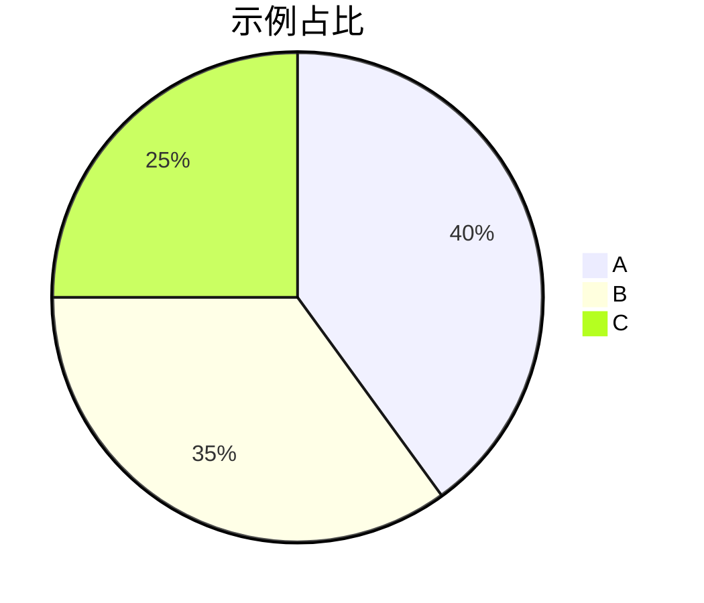

# Markdown 语法示例

对照左侧源码和右侧预览，看 M記 对常见 Markdown 与扩展语法的渲染效果。Wiki 链接、附件嵌入见 [[02-Obsidian-内联语法示例]]；入门说明见 [[00-快速上手]]。

## 正文

### 强调

普通 **粗体**、_斜体_、**_粗斜体_**、`行内代码`，以及 ~~删除线~~。

标题用 `#` 到 `######`（ATX 风格）。段落之间空一行；行末两个空格再回车，可以在同一段内换行。

### 链接与图片

[带标题的链接](https://example.com "示例站点")

[相对路径](./00-快速上手.md)

自动链接：<https://spec.commonmark.org/>

裸 URL：https://example.com/doc

转义：\*不是斜体\* \`不是代码\` \[不是链接\]

### 引用

> 单层引用  
> 第二行

> 外层
>
> > 内层引用

### 列表

**无序**

- 一级
  - 二级
    - 三级
- 回到一级

**有序**

1. 第一步
2. 第二步

- 嵌套无序

3. 第三步

**字母 / 罗马数字**

A. 大写字母
B. 第二项

a. 小写字母
b. 第二项

ii. 罗马数字
iii. 下一项

**任务列表**

- [ ] 待办
- [x] 已完成
  - [ ] 嵌套待办

### 代码

行内 `const x = 1`，以及围栏代码块：

```javascript
function hello(name) {
  return `Hello, ${name}!`;
}
```

```ts
export type Theme = "light" | "dark";
```

```json
{ "ok": true, "count": 3 }
```

### 表格

| 左对齐 |  居中  | 右对齐 |
| :----- | :----: | -----: |
| L      |   C    |    1.0 |
| `code` | **粗** |    200 |

### 分隔线

---

## 数学公式

行内：$e^{i\pi} + 1 = 0$，以及 $\sum_{i=1}^{n} i = \frac{n(n+1)}{2}$。

块级：

$$
\int_0^1 x^2 \, dx = \frac{1}{3}
$$

$$
\begin{aligned}
f(x) &= x^2 \\
f'(x) &= 2x
\end{aligned}
$$

$$
\mathbf{A} = \begin{bmatrix}
1 & 2 \\
3 & 4
\end{bmatrix}
$$

## Mermaid 图表






语言标签写 `mmd` 也可以：

```mmd
flowchart LR
  p1([入口]) --> p2[处理]
  p2 --> p3([出口])
```

## 脚注

正文里写引用[^fn-demo]，定义放在文末。

[^fn-demo]: 这是脚注正文。

## 组合写法

1. 有序一级

- 无序子项
- 另一子项

2. 有序二级

> 引用里也可以放列表：
>
> - 一项
> - 另一项

<details>
<summary>折叠区块（HTML details）</summary>

若预览允许，点开后可以看到这段说明。

</details>

---

以本应用预览为准。双链与嵌入见 [[02-Obsidian-内联语法示例]]。
