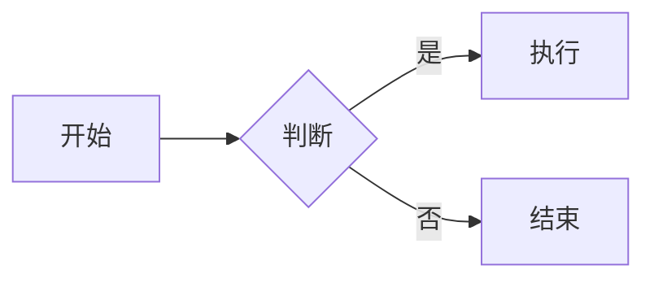

# Obsidian 内联语法

## Wiki 链接

链接到同知识库的其他笔记：

[[01-Markdown-语法示例]]

## 附件嵌入

### 嵌入图片

![[图片名.png]]

### 嵌入 PDF

![[document.pdf]]

### 嵌入笔记片段

![[01-Markdown-语法示例#标题]]

## Mermaid 图表

## 数学公式

行内：$E = mc^2$

块级：

$$
\int_{-\infty}^{\infty} e^{-x^2} dx = \sqrt{\pi}
$$

---

*M記 完全兼容 Obsidian 的链接语法*
