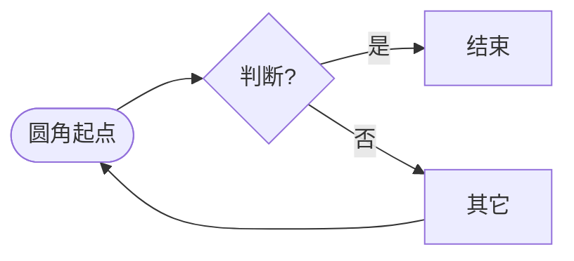
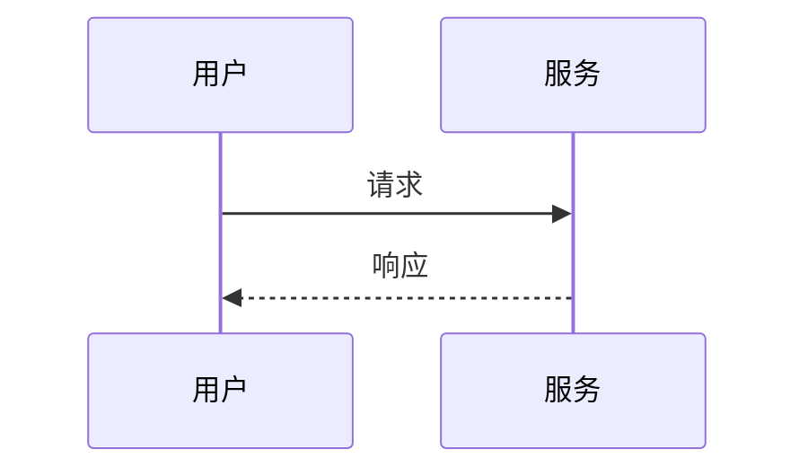

---

## title: Syntax fixture
description: 预置语法示例 — Obsidian 取向，供预览手测与 Vitest 整文件渲染
tags: [fixture, markdown]

> 说明：带 **（gap）** 的区块在 Obsidian 中有语义，本应用可能仅按普通 Markdown 渲染；用于对照差距。

# 一级标题 `code-in-heading`

## 二级 · 强调与删除线

普通 **粗体**、*斜体*、***粗斜***、`行内代码`、`反引号内 \` 转义`。

~~删除线~~（GFM / markdown-it 内置）

==高亮==（**gap**：Obsidian 默认；此处多为字面 `==`）

## 三级 · 链接与图片

[带标题的链接](https://example.com)

[相对路径](./obsidian-markdown-samples.md)

自动链接：[https://github.com](https://github.com)

裸 URL（linkify）：[https://example.com/path](https://example.com/path)

含空格 URL（预处理角括号）： [spaced](https://example.com/a%20b/c) 

替代文字

## 四级 · Wiki 与嵌入

`[[无别名]]`：[[Sample Note]]

`[[路径或标题|显示文本]]`：[[Projects/Index|项目索引]]

`[[#仅标题]]`：[[#语法示]]

`[[其他笔记#^block-id]]`：[[Sample Note#^block-id]]

嵌入（解析为 data 属性，预览再增强）：![[attachments/screenshot.png|300]]

## 五级 · 脚注与高亮（gap 对照）

脚注引用与定义[^fn1](第一条脚注正文。)，另一处[^fn2]。

[^fn2]: 第二条，含 `代码`。

（**gap**：若未启用脚注插件，上式可能不按脚注渲染。）

## 六级 · 列表

### 无序嵌套

- 一级
  - 二级
    - 三级
- 回到一级

### 有序与混合

1. 第一步
2. 第二步
  - 嵌套无序
3. 第三步

### 任务列表（GFM）

- 未完成
- 已完成
  - 子任务

## 引用与 Callout（Callout 为 gap）

> 单层引用  
> 第二行

> 嵌套引用
>
> > 内层引用

> [!note] Callout 标题（**gap**：Obsidian Callout；此处多为普通引用 + 字面文本）

> [!warning] 警告类型
> 正文第二行。

## 代码

行内 `const x = 1` 与围栏（无高亮器时仍为 `<pre><code>`）：

```javascript
function hello(name) {
  return `Hello, ${name}!`;
}
```

```ts
type Id = string & { __brand: 'Id' };
```

缩进代码块（4 空格）：

```
line one
line two
```

````mmd` 别名：

```mmd
flowchart TB
  X --> Y
```

## 表格


| 左对齐   | 居中  | 右对齐 |
| ----- | --- | --- |
| a     | b   | c   |
| **粗** | `码` | 123 |


## 分隔线

---

---

---

## 数学（KaTeX）

行内：$\alpha + \beta = \gamma$，以及分数 $\frac{1}{2}$。

块级（多行）：

$$
\begin{aligned}
a &= 1 
b &= a + 1
\end{aligned}
$$

故意错误（应降级而非崩页面）：$ \broken\left $

## Mermaid

### flowchart



### sequenceDiagram



## HTML（允许 html + 净化后保留的安全子集）

可折叠（能否展开取决于 DOMPurify 白名单）

折叠内段落。


## 块 ID（Obsidian）

本段落后单独一行写 ID（当前实现：整段仅为 `^id` 时挂到上一块）。

^heading-anchor-sample

## 注释与标签（Obsidian 语义 / 部分 gap）

%% 这是 Obsidian 风格注释，导出时通常忽略 %%

行内 #标签 在 Obsidian 可检索；此处多为普通文本。

## 换行（breaks: true）

第一行（行末两个空格）  
第二行仍属同一段落。

## 转义与字面量

not emphasis  not code  not link

## 任务边界：长 Mermaid（性能）

以下为占位注释；若需压测「>20 图」可在此重复粘贴多个 `mermaid` 块。

