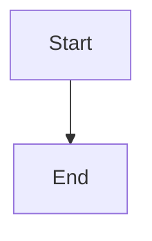

# Release parity fixture

## Shiki fenced code

```typescript
const answer = 42;
```

## Mermaid diagram



## KaTeX math

Inline $E = mc^2$ and display:

$$
\sum_{k=1}^{n} k = \frac{n(n + 1)}{2}
$$

## Wiki links and embeds

See [[Other Note|alias]] and [[#shiki-fenced-code]].

Image embed with width: ![[assets/diagram.png|320]]

PDF embed entry: ![[attachments/report.pdf|480x640]]

Generic attachment link: [[attachments/archive.zip]]
